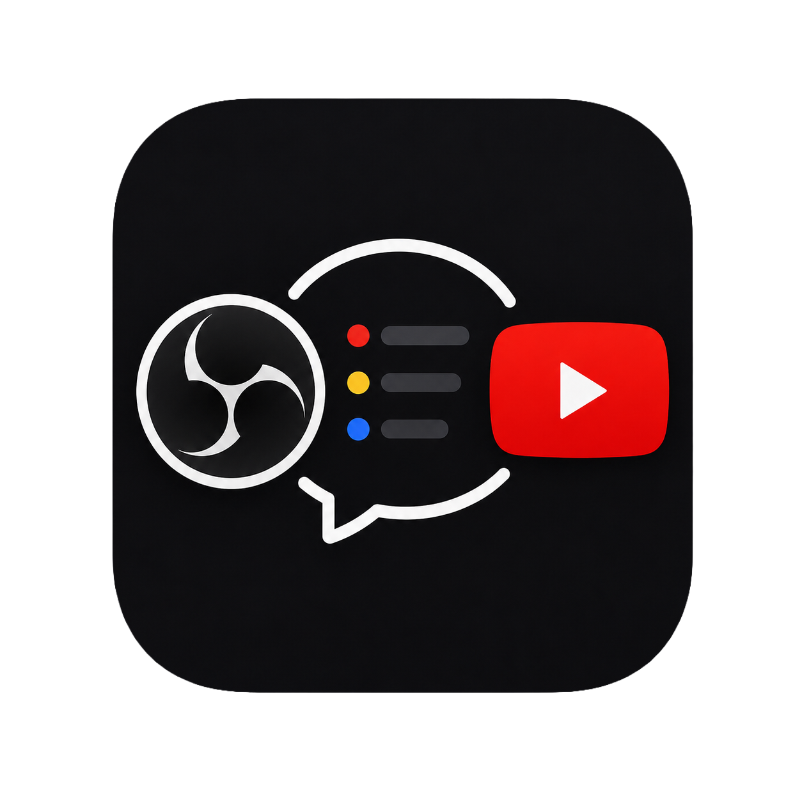
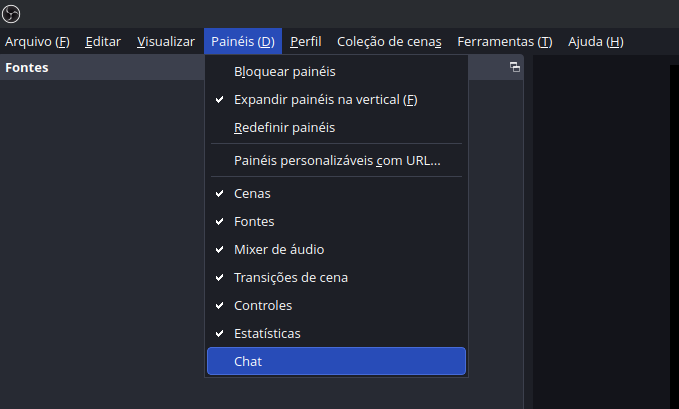
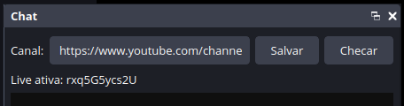
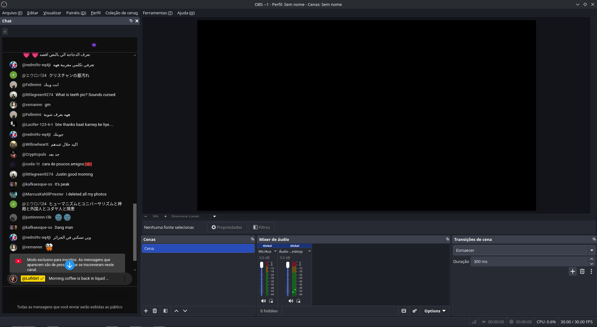

# OBS YouTube Chat Dock

<div align="center">



<h3>Simple YouTube live chat dock for OBS Studio</h3>

<p>
Paste a YouTube channel link once. The plugin checks the channel <code>/live</code>
page periodically and automatically loads the live chat pop-out inside OBS.
</p>

</div>

<hr>

## Requirements

- OBS Studio 30+
- `obs-browser` plugin available in OBS
- Linux, Linux Flatpak, or Windows 64-bit
- For local builds: CMake 3.22+, Qt 6.4+, and OBS development headers

On Linux, the `obs-browser` dock usually does not work properly on native
Wayland. Use X11/XWayland instead. If your session is Wayland, start OBS with:

```bash
QT_QPA_PLATFORM=xcb obs
```

## Fast Start

Close OBS before installing or updating the plugin.

Regular Linux:

```bash
chmod +x installers/linuxplugin
./installers/linuxplugin
```

Linux with OBS Flatpak:

```bash
chmod +x installers/flatpaklinuxplugin
./installers/flatpaklinuxplugin
```

Windows:

```bat
installers\windowsplugin.bat
```

Then open OBS:

```txt
Docks > Chat
```

Paste a link such as:

```txt
https://www.youtube.com/@channel
https://www.youtube.com/channel/UC...
https://www.youtube.com/watch?v=VIDEO_ID
```

Click `Salvar` or `Checar`. When a live stream is detected, the dock opens the
YouTube pop-out chat:

```txt
https://www.youtube.com/live_chat?v=VIDEO_ID&is_popout=1
```

## Screenshots

Open the dock from OBS:

<p align="center">

</p>

Set the YouTube channel:

<p align="center">

</p>

Chat running inside OBS:

<p align="center">

</p>

## Manual Build

Linux:

```bash
cmake -S . -B build -DCMAKE_BUILD_TYPE=Release
cmake --build build --config Release
cmake --install build --prefix "$HOME/.config/obs-studio/plugins"
```

Windows:

```bat
cmake -S . -B build -DCMAKE_BUILD_TYPE=Release
cmake --build build --config Release
cmake --install build --prefix "%ProgramData%\obs-studio\plugins"
```

If CMake cannot find OBS, pass the prefix manually:

```bash
cmake -S . -B build -DCMAKE_PREFIX_PATH="/path/to/obs"
```

## Notes

The plugin uses the public YouTube page to detect live streams. This avoids an
API key, but it can break if YouTube changes the page HTML.

The Windows binary distributed in `dist/windows/chat-dock.dll` was built for OBS
32.x.

## Author

Created and maintained by Adham Cabral.
